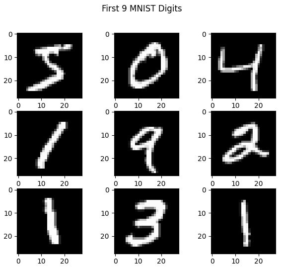

# Predicting handwritten digits with Keras
The MNIST dataset is an extremely common dataset used to train models for recognizing hand-written digits. In this simple project, I've created a simple neural network with keras to make these predictions. Due to the overall simplicity of the MNIST dataset, I used an ordinary neural network instead of a convolutional neural network (i.e. with convolution and pooling layers), whilst still achieving an accuracy of 98%.

Here, I used an 'Flatten' keras input layer, which converts the 1x28x28 dimensional images into a 784-long flattened layer. This input layer is then connected to 2 hidden layers with 64 neurons each and a ReLU activation function. The output layer consists of 10 neurons, representing the categorical digit outputs 0 to 9.

An example of the MNIST hand-written images are shown below:

